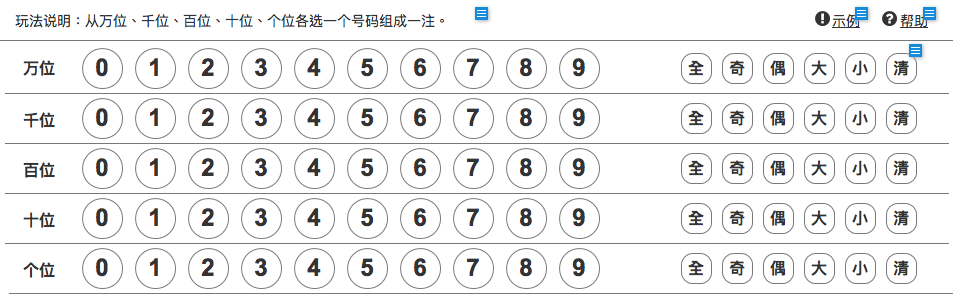
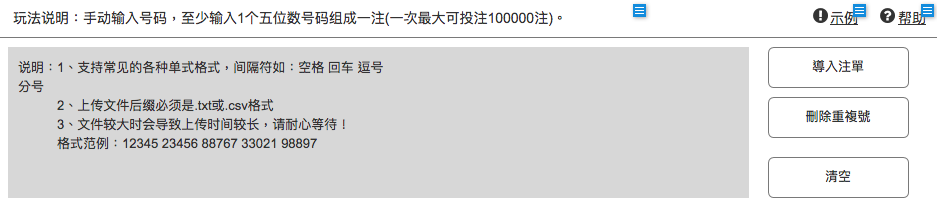

# 天瀚國際科技 資深全端工程師問卷問題
===

# Backend
### 1. 請實作下列需求
假設目前有個需求，需要透過多個號源站抓取各彩種指定期號的中獎號碼
可使用 Laravel 或您熟悉的程式語言，請設計出架構，實現剛好滿足需求並具有擴充性程式碼

- 規格如下
    - 需主號源及任一副號源比對相同才成功（主號源只有一個，副號源將會有多個）
    - 不同彩種會有不同主號源需求 
    - `重慶時時彩`，請以號源一為主號源
    - `北京11選5`，請以號源二為主號源
    - 有擴充彩種及號源站需求

> 附註：
> `彩種`為彩票的供應商，例如 `重慶時時彩`、`北京11選5` 等等
> `號源`為第三方 API 廠商，整合各彩種開獎號碼
-  使用方式
```php
<?php
class UpdateWinningNumberJob
{
    protected $lottery;

    public __construct(Lottery $lottery)
    {
        $this->lottery = $lottery;
    }

    public function handle()
    {
        try {
            // $this->lottery->gameId 為 int，指彩種編號，
            // 重慶時時彩 = 1
            // 北京11選5 = 2
            // $this->lottery->issue 為 string , 為此 lottery 期號（e.g. "20190903001"）
            $target = new xxxx($this->lottery); // 請實現此 class
            $this->lottery->update([
                'winning_number' => $target->getWinningNumber();
            ]);
        } catch (FetchFailureException $e) {
            Log::error('Something went wrong.');
        }
    }
}

```

- 號源一 API（為模擬簡化，非正式 API）
`GET http://one.fake/v1?gamekey={gamekey}&issue={issue}`
`gamekey` 為彩種編號
`issue` 為開獎期號

**gamekey 對照表**
`重慶時時彩` => `ssc`
`北京11選5` => `bjsyxw`

```json
// GET http://one.fake/v1?gamekey=ssc&issue=20190903003
{
  "result": {
    "cache": 0,
    "data": [
      {
        "gid": "20190903003",
        "award": "0,6,2,2,3",
        "updatetime": "1567446006"
      }
    ]
  },
  "errorCode": 0
}
```

- 號源二 API（為模擬簡化，非正式 API）
`GET https://two.fake/newly.do?code={code}`
`code` 為彩種編號

**code 對照表**
`重慶時時彩` => `cqssc`
`北京11選5` => `bj11x5`

```json
// GET https://two.fake/newly.do?code=cqssc
{
  "rows": 3,
  "code": "cqssc",
  "data": [
    {
      "expect": "20190902003",
      "opencode": "3,8,1,9,5",
      "opentime": "2019-09-02 01:12:46"
    },
    {
      "expect": "20190902002",
      "opencode": "3,1,5,8,6",
      "opentime": "2019-09-02 00:52:37"
    },
    {
      "expect": "20190902001",
      "opencode": "6,1,9,0,3",
      "opentime": "2019-09-02 00:32:03"
    }
  ]
}
```

### 2. 上面程式或規格可能存在什麼潛在問題？還可以怎樣優化？
文字描述即可

### 3. 如果要加入第三家號源，會怎麼進行擴充？
文字描述即可

### 4. 每個號源有不同的速率限制，會如何實現限流，防止被 ban？
假設號源一限制 5 秒一次，號源二限制 3 秒一次
> 同號源不同彩種是分開計算的

文字描述即可

### 5. 開獎時間並非準時，您會如何實現重試機制？
號源站並非能第一時間抓到該彩種中獎號碼，因此存在抓不到的可能性

文字描述即可

### 6. 可以實現哪些手段來減少程式運行時間？
文字描述即可


# Frontend
### 1. 請實作下列需求
製作一個彩票投注的頁面，能先選擇彩種，後選擇玩法，
讓玩家選擇號碼後，按下投注按鈕，發送請求至後端投注。
可使用 Vue React 等現代框架實現，請盡量考慮擴充性與復用性。

-  要求
    1. 當玩家選擇的號碼，不是有效投注的時候，投注按鈕將無法使用。
    2. 當按下投注時，請根據玩法與玩家選擇的產生號碼格式，送至投注 API。
    3. 請注意==總和大小單雙==有特殊要求
- 彩種 (publisher)
    - 重慶時時彩
        - id: `1`
        - 玩法：
            - 直選複式
            - 總合大小單雙
    - 北京11選5
        - id: `2`
        - 玩法：
            - 直選複式
            - 直選單式
- 玩法 (playing_method)
    - 直選複式
        - id: `1`
        - 畫面與玩法如下
        
        - 號碼格式
            - `[[1], [3], [5], [6], [7, 8]]`
            - 玩家選擇了
                - 萬位的 1
                - 千位的 3
                - 百位的 5
                - 十位的 6
                - 個位的 7 跟 8
    - 直選單式
        - id: `2`
        - 畫面與玩法如下
        
        - 號碼格式
            - `[[1, 2, 3, 4, 5], [2, 3, 4, 5, 6]]`
            - 玩家輸入了 `12345 23456`
    - 總和大小單雙
        - id: `3`
        - 畫面與玩法如下
        
        - 號碼格式
            - `[1, 2, 3]`
            - 玩家選擇了
                - 總和大
                - 總和小
                - 總和單
            - 選項
                - 總和大: 1
                - 總和小: 2
                - 總和單: 3
                - 總和雙: 4
        - 特殊要求
            - 總和大小爲一組
            - 總和單雙爲一組
            - 一組只能選擇一個
            - 當已經選擇其一，又按下另一個時，會保留==另一個==，取消選取其一
            - 當已經選擇總和大，又按下總和小時，會保留==總和小==，取消選取總和大


- 投注 API
```json
// POST http://three.fake/v1/lottery/bet
{
    "publisher_id": 1,
    "playing_method_id": 1,
    "numbers": []
}
```

### 2. 如果要加入第三個彩種，會怎麼進行擴充？
文字描述即可

### 3. 如果要加入第四個玩法，會怎麼進行擴充？
文字描述即可

### 4. 直選單式玩法中的刪除重複號，該如何改進效能？
直選複式會需要處理超過 50000 組數字，請說明如何快速去重複。
文字描述即可

### 5. 如果要設計 dark mode，該如何設計？
文字描述即可

### 6. 如果此專案有 i18n 的要求，該如何設計架構與翻譯等相關流程？
文字描述即可
